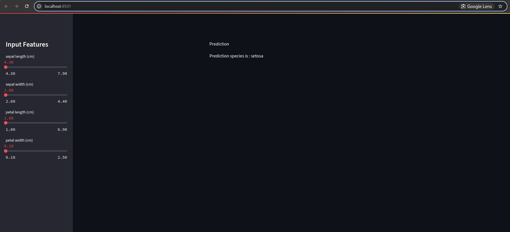

# Streamlit Iris Visualizer

A simple and interactive web application built with Streamlit to explore and visualize the famous Iris dataset from scikit-learn.

## Features

- **Load the Iris dataset** directly from scikit-learn.
- **Interactive data visualization**: scatter plots, histograms, and more.
- **Explore feature relationships** and class distributions.
- **User-friendly interface** for data science beginners.

## Demo

 <!-- Replace with your own screenshot -->

## Getting Started

### Prerequisites

- Python 3.6+
- pip

### Installation

1. **Clone the repository:**

The app will open in your browser. You can interact with the dataset and visualizations.

## Project Structure

| File/Folder      | Description                                 |
|------------------|---------------------------------------------|
| `app.py`         | Main Streamlit application                  |
| `requirements.txt` | List of Python dependencies               |
| `README.md`      | Project documentation                       |

## Technologies Used

- [Streamlit](https://streamlit.io/)
- [scikit-learn](https://scikit-learn.org/)
- [pandas](https://pandas.pydata.org/)
- [matplotlib](https://matplotlib.org/) or [seaborn](https://seaborn.pydata.org/)

## About the Iris Dataset

The Iris dataset is a classic dataset in machine learning, containing 150 samples of iris flowers with four features: sepal length, sepal width, petal length, and petal width. The goal is to classify the samples into three species: Setosa, Versicolor, and Virginica[3][12].

## License

This project is licensed under the [GNU General Public License v3.0 (GPL-3.0)](https://www.gnu.org/licenses/gpl-3.0.en.html).  
You are free to use, modify, and distribute this software under the terms of this license.

## Acknowledgments

- The Iris dataset: UCI Machine Learning Repository
- Streamlit community and documentation

